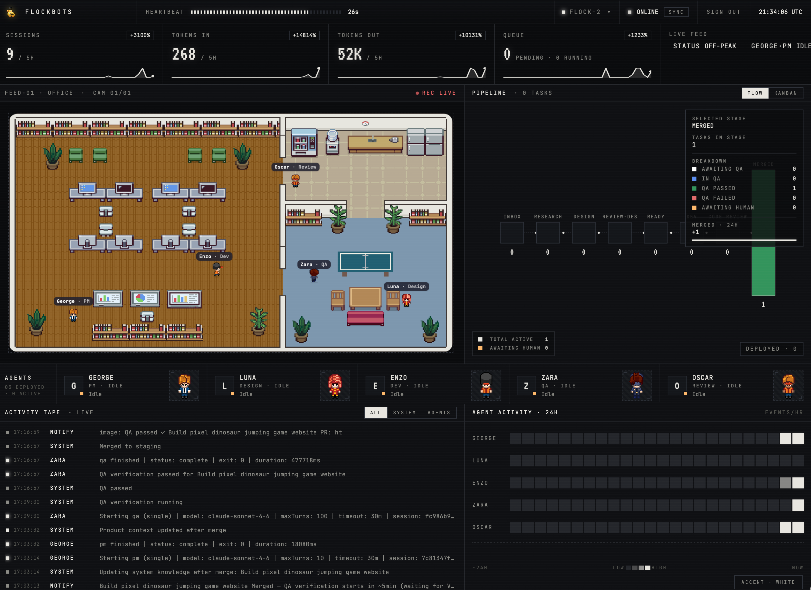
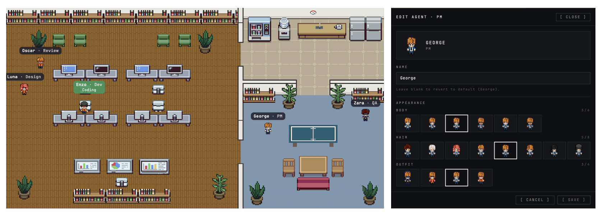
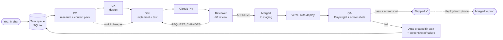
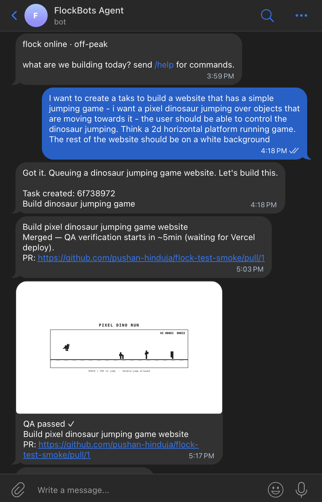
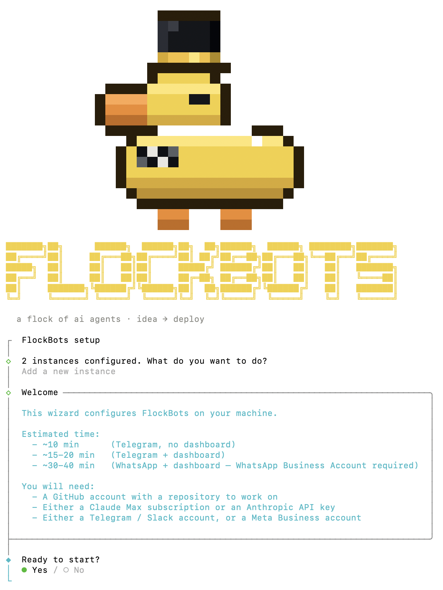

# FlockBots — Your Autonomous AI Engineering Team

> A flock of specialized AI agents that ships production code for you — from a chat message on your phone to a QA-verified deploy.

<p align="center">
  
</p>

```bash
curl -fsSL https://raw.githubusercontent.com/pushan-hinduja/flockbots/main/install.sh | bash
flockbots init
```

Self-hosted. ~10 minutes to a running flock. Your code stays on your machine; only Claude + GitHub traffic leaves the box.

---

## Use your existing Claude subscription — no API costs

FlockBots authenticates through the `claude` CLI's OAuth session, exactly the way Claude Code does.

- **If you already have a Claude Max or Pro subscription**, the entire flock runs on it. Every PM, UX, Dev, Reviewer, and QA session counts against your subscription the same way an interactive Claude Code chat would — **no API keys, no per-token billing, no new bill.**
- **If you don't have a subscription**, you can still use an Anthropic API key (`sk-ant-…`) — pay-per-token, no subscription required.

The wizard lets you pick either at setup; you can switch later by editing `~/.flockbots/.env`. Get the absolute maximum value out of a subscription you're already paying for.

---

## The problem with vibecoding

The "chat with an AI and ship whatever it says" workflow has real problems:

| Problem | What it costs you |
|---------|-------------------|
| **No context retention** | Every session starts from scratch. The model re-reads your codebase every time, burning tokens on exploration that's already been done. |
| **No review layer** | The same AI that wrote the code "reviews" it. Self-bias makes the review superficial. Bugs, security holes, and off-scope changes slip through. |
| **Manual QA** | The model says "done." Does it actually work in a browser? You still have to check. |
| **Lost progress on failures** | Rate limit hit mid-task? Network blip? You lose intermediate work and restart from zero. |
| **Token blackhole on large repos** | Broad greps, blind file reads, and repeated exploration burn budget on a 50k-file codebase. |
| **Locked to your laptop** | You have to be at your machine to chat. No shipping from a phone. |
| **No multi-step orchestration** | Design → code → test → review → ship is seven manual back-and-forths, not a pipeline. |

## How FlockBots solves it

| Problem | FlockBots' answer |
|---------|-------------------|
| No context retention | **PM agent writes a context pack once.** Every downstream agent reads it instead of re-exploring — research cost paid once per task. |
| No review layer | **Two separate GitHub App identities** — PR author and reviewer are distinct, and the reviewer runs a fresh Claude session with a mandatory review checklist. |
| Manual QA | **QA agent drives your deployed staging env** via Playwright, screenshots the result, and messages you pass/fail with images. |
| Lost progress | **SQLite-backed state + resumable sessions.** Crashes and rate-limit hits are recovered on next pipeline tick. |
| Token blackhole | **Knowledge graph indexing.** Agents query a graph of your codebase (symbols, imports, call sites) via `mcp__graphify__*` tools — ~5–10× cheaper than grep on real repos. |
| Locked to laptop | **Telegram / Slack / WhatsApp.** Your phone is the interface. |
| No pipeline | **Stage-gated orchestrator** enforces pass/fail between every agent, handles retries, surfaces escalations through your chat channel. |

---

## The flock — specialized agents, coordinated

Not one AI writing code. A **team of specialized agents**, each with a defined role, system prompt, and tool set, handing work off through disk-persistent artifacts. A **coordinator** picks the right agent at the right stage and enforces gates between them.

### PM — research + specification

Starts every task. Its job is to do all the exploration work once so nobody else has to repeat it.

- Surveys the codebase using **graphify MCP tools** — symbol lookup, import graph, blast-radius queries — instead of brute-force grep.
- Reads your project's `skills/` knowledge: product vision, domain concepts, architecture decisions, code conventions, design guidelines.
- Classifies the task's **effort size** (XS → XL) and picks the right Claude model per downstream agent — **Sonnet** for typical work, **Opus** for complex / high-stakes changes (large refactors, security-sensitive code, architectural calls). Working agents only ever run on Sonnet or Opus.
- Decides if a UX stage is needed based on whether any UI changes are in scope.
- Writes a **context pack** to `tasks/<id>/context.json` — structured JSON with the spec, affected files, relevant snippets, design hints. This is what every other agent reads.
- Escalates to you (via chat) if requirements are ambiguous — rather than guessing.

### UX — design

Runs only when the task touches UI.

- Reads design skills: `principles.md`, `components.md`, `layouts.md`, `responsive.md`, `motion.md` — your project's visual language.
- Picks existing components from your library rather than reinventing them.
- Produces component specs, layout notes, interaction states, responsive behavior — added to the context pack for dev.

### Dev — implementation

Where actual code gets written.

- Runs in an **isolated git worktree** under `~/.flockbots/tasks/<id>/` — never touches your main branch checkout.
- Reads the context pack — never re-explores what PM already surveyed.
- For L/XL tasks, enters **swarm mode**: the dev session spawns parallel sub-agents via the Agent tool, each working on a different file. The parent agent integrates their outputs.
- Runs your project's test / lint / typecheck commands (auto-detected from `package.json` at wizard time, overridable in `.env`).
- Retries up to 5× with accumulated review feedback if the reviewer blocks.
- Opens the PR via the **"FlockBots Agent" GitHub App identity** — separate from your personal account, separate from the reviewer.

### Reviewer — fresh eyes

Runs after Dev pushes. Mandatory gate before merge.

- **Separate GitHub App identity** — posts formal GitHub reviews as "FlockBots Reviewer", distinct author from the PR.
- **Separate Claude session** — zero context from Dev's session, forced to reason from the diff alone.
- Runs against a review checklist enforced by prompt: correctness, security (SQL injection, XSS, secrets, auth bypass), quality (project conventions, dead code, over-engineering), scope (no unrelated refactors).
- Posts `APPROVE` or `REQUEST_CHANGES` as an actual GitHub review — so you see it in the PR UI.
- On retry rounds, the session is **scoped to "verify the fix," not "re-review the whole PR"** — cheaper and more honest.

### QA — deploy + real browser test (optional)

Runs after merge. Tests the *deployed* code, not the diff.

- Waits a configurable window (`QA_DEPLOY_WAIT_MS`, default 5 min) so Vercel / your CI has time to ship.
- Drives the staging URL via **Playwright MCP** — navigates, fills forms, clicks through flows, asserts on the rendered DOM.
- Handles login automatically if you gave it test credentials; skips login on public-facing sites.
- **Takes screenshots and short video clips** of both happy paths and failures, uploads them to your Supabase Storage bucket as signed URLs, and sends them to your chat provider — so you see the actual rendered change on your phone.
- On failure: auto-creates a fix-it task with the screenshot + failure details, puts it back at the top of the queue for Dev to address.
- **Requires Supabase** — screenshots + video clips land in the `qa-media` Storage bucket. If you skip the dashboard/Supabase step during `flockbots init`, QA is unavailable and the wizard skips the step entirely.

> **You bring the deploy, QA brings the test.** The QA agent visits whatever URL you set as `STAGING_BASE_URL` during `flockbots init` — it doesn't deploy anything itself. You need an auto-deploy hooked up to your staging branch so a fresh build is live by the time QA opens the browser. **Vercel is the recommended setup**: connect Vercel to your GitHub repo, point the production deployment at your `main`/`prod` branch and a preview/production deployment at your `staging` branch (in two-branch mode), and Vercel ships every merge automatically. Then `STAGING_BASE_URL=https://your-app-staging.vercel.app` and QA always tests the post-merge build for *that* branch — never the wrong environment. Without a working auto-deploy at the URL you configured, QA times out waiting for the deploy and fails the verification.

### Coordinator — the orchestrator

Not a Claude agent — a plain Node process. The glue that makes the flock work as a team.

- **SQLite-backed queue** — every task, event, token-usage record, escalation persists to disk.
- **Per-agent concurrency locks** — Dev and Reviewer can work on different tasks in parallel; same agent can't run twice concurrently.
- **Cron-driven pipeline tick** — every minute, picks the next runnable task from the queue based on agent availability and stage.
- **Crash-safe session recovery** — on startup, any task stuck in `developing` from a prior crash is rolled back to `dev_ready` for safe retry.
- **Rate-limit-aware scheduling** — parses Claude retry times from errors, pauses until the limit clears, resumes automatically.
- **Peak-hours deferral** — L/XL tasks are deferred during configured peak windows (default 5-11am PT weekdays) so you don't burn budget when you need Claude for interactive work.
- **Health monitor** — watches disk space, stale worktrees, orphaned processes.
- **Heartbeat** to Supabase (when enabled) so the dashboard knows if the flock is online.

<p align="center">
  
</p>

The dashboard renders all of this as an **office view** — a live pixel-art visualization where each agent sits at their desk. You can watch them think, write, review, and hand off work in real time. The whole flock in one glance.

**Customize each agent.** Click any agent in the office (or their name in the roster) to open the editor — rename them, swap body / hair / suit sprite rows, save. Names and appearance persist per-user in Supabase, so different operators looking at the same dashboard can keep their own roster theme without stepping on each other.

---

## How agents stay efficient

### Knowledge graph of your code

FlockBots optionally indexes your entire target codebase into a queryable graph using [graphify](https://graphify.net). Symbols, imports, call sites, concept-to-file mappings all get baked into `skills/kg/graph.json`.

Instead of `grep -rn "UserAuth"` (which returns every string match across every file — mostly noise, and every match gets read into a token-expensive agent session), agents call `mcp__graphify__symbol_lookup("UserAuth")` which returns the exact definition + callers in one shot.

**~5–10× token reduction on typical lookups in real repos.**

Built via `flockbots kg build` (offered during `flockbots init` or anytime later). Post-merge commits trigger an incremental graph update in the background so the index stays fresh.

### Context pack reuse

The most expensive token-spend in a naive LLM pipeline is repeated exploration — every agent session relearning the codebase.

FlockBots solves this by making the **PM agent the only stage that researches**. PM writes a structured JSON context pack to `tasks/<id>/context.json` containing:

- Task spec + acceptance criteria
- Affected files (with line ranges)
- Relevant code snippets pre-extracted
- Design decisions + constraints
- Which models + effort levels to use downstream

UX, Dev, and Reviewer agents **read the pack**. They don't re-explore. Research cost is paid once per task, not N times.

### Smart queueing + rate-limit awareness

The scheduler isn't a dumb FIFO — it's budget-aware.

- **Peak-hours deferral**: during configured peak windows (default 5-11am PT, weekdays), L/XL tasks are skipped so small/medium tasks can slip through under the rate cap. L/XL tasks resume off-peak.
- **Calibration loop**: if a session hits a rate limit, the coordinator parses the retry timestamp from Claude's error, pauses all sessions until it clears, then resumes. A relaxation cron slowly walks the budget estimate back down over 30 min after a hit.
- **Per-agent concurrency**: PM, UX, Dev, Reviewer each hold their own lock. A reviewing task doesn't block a new task from entering the PM stage.
- **Dashboard action polling**: retry / dismiss / revert-stage actions from the web dashboard are picked up every 10 seconds.

Net effect: you can queue 50 tasks at once and walk away. The flock will pace itself, route around rate limits, and make maximum use of your Claude subscription over the day.

---

## The pipeline



Every arrow is a gate. Every stage is a `claude -p` session with a tailored system prompt. Every output is a file on disk you can inspect.

---

## From a chat message to production — all from your phone

The full power move, end to end:

1. **You send a WhatsApp / Telegram / Slack message**: *"Add a dark-mode toggle to the settings page."*
2. **Coordinator picks up the task**, queues it, acknowledges in chat.
3. **PM agent** researches: reads your design skills, finds the settings page file, identifies how theme state is managed.
4. **UX agent** picks the toggle component from your library, writes style notes.
5. **Dev agent** implements in an isolated worktree, runs tests + lint + typecheck, opens a PR.
6. **Reviewer agent** reads the diff, checks for security / correctness / scope, posts APPROVE.
7. **PR merges to staging**. Your **Vercel auto-deploy** (recommended — connects to your GitHub branches and ships on every merge without any extra CI config) pushes to `staging.your-app.com`.
8. **QA agent** waits for the deploy, drives staging in headless Chromium — opens the settings page, clicks the toggle, verifies the theme changes, screenshots both states.
9. **You get a WhatsApp message with the screenshots.** "QA passed: light mode → dark mode. Screenshot 1 + 2 attached."
10. **You reply `/deploy`** from your phone. Coordinator opens a second PR, staging → production, and merges it.
11. **Vercel deploys to production.** You're done. Total time on the task from you: two messages.

No laptop. No dev env. No context switching from whatever you were doing.

---

## Talk to your flock

Three chat providers ship in the box. Pick whatever fits your workflow.

| Channel | Setup time | Best for |
|---------|-----------|----------|
| **Telegram** | ~2 min via [@BotFather](https://t.me/BotFather) | Solo operators who want the fastest path |
| **Slack** | ~5 min (Socket Mode workspace app) | Teams where FlockBots lives in a shared channel |
| **WhatsApp** | ~30–40 min (WhatsApp Business Account required) | Best for users who prefer WhatsApp as their primary communication tool |

<p align="center">
  
</p>

### Natural language, not slash commands

You don't memorize commands. A lightweight **Claude Haiku router** parses every incoming chat message into the structured command the coordinator understands — so you can talk to your flock like you would a real team:

- *"can you retry that failed task?"*
- *"merge the latest PR to prod"*
- *"skip QA on that one, I already tested it manually"*
- *"what's the queue look like?"*
- *"actually, scrap that, I changed my mind"*

Haiku is fast, cheap, and precisely right for intent-to-command mapping — never used for actual engineering work, where only Sonnet and Opus run. Slash commands (`/retry <id>`, `/deploy`, `/dismiss`) still work if you prefer explicit control.

Or use the terminal:

```bash
flockbots task add "Add a dark-mode toggle to the settings page"
```

---

## Integrations

FlockBots connects to a handful of external services. Only the first three are required; everything else is optional (but some are strongly recommended).

| Service | Role | Required? | Notes |
|---------|------|-----------|-------|
| **Anthropic Claude** | Runs every agent session (PM, UX, Dev, Reviewer, QA, chat router) | Yes | Use your **Claude Max/Pro via OAuth** (recommended — no per-token cost) or an Anthropic API key |
| **GitHub** | Hosts your target codebase; two apps handle PR authorship + reviewer identity | Yes | Two GitHub Apps auto-created by the wizard via the manifest flow (~30 seconds each) |
| **Telegram / Slack / WhatsApp** | Chat interface — how you talk to the flock | Yes (pick one) | Telegram fastest to set up; WhatsApp is best for users who prefer it as their primary communication tool — see [`docs/setup/whatsapp.md`](docs/setup/whatsapp.md) for the full Meta + webhook-relay walkthrough |
| **Vercel** | Auto-deploy on merge to staging and prod | **Recommended** | Connect your GitHub branches to Vercel — every merge ships automatically, so QA can test the actual deployed URL and `/deploy` from chat becomes a real one-tap prod release |
| **Supabase** | Powers the live web dashboard: task history, token usage, office view, QA screenshot hosting | Optional | Free tier works. Skip if you're CLI-only |
| **Linear** | **Two-way sync** — pulls labeled Linear issues into the task queue as triggers, and the coordinator writes back: PR links, stage transitions, completion notes, failure reasons enriched onto the ticket as comments. Your Linear board becomes a live view of everything the flock is doing | Optional | Skip unless you already track work there |
| **graphify** | Knowledge graph index of your codebase — cuts agent token usage ~5–10× on symbol / import / call-site lookups | Optional | **The wizard can install + build it for you automatically** (`pip install --user graphifyy` → first graph build takes 10–30 min on a real repo); or run `flockbots kg build` anytime later |

---

## Install

```bash
curl -fsSL https://raw.githubusercontent.com/pushan-hinduja/flockbots/main/install.sh | bash
```

Installs into `~/.flockbots/`, symlinks the `flockbots` CLI into `/usr/local/bin`, checks for Node 20+, git, Python 3.11+, Claude CLI, and build tools. Tells you what's missing if anything is.

Then run the wizard:

```bash
flockbots init
```

<p align="center">
  
</p>

Start the coordinator:

```bash
cd ~/.flockbots && pm2 start ecosystem.config.js
```

Send your bot a message or `flockbots task add "<description>"`.

---

## Setup options at a glance

Everything the wizard will ask. Any row can be changed later — re-run `flockbots init` and the wizard offers a **reconfigure picker** so you can edit just the sections you care about (see [Reconfiguring](#reconfiguring-an-existing-install) below).

A few steps have **dependencies** on other steps — these are called out in the "Depends on" column. The wizard automatically enforces them (e.g. picking WhatsApp forces the dashboard step on; skipping the dashboard hides the QA step).

| Step | Required? | Depends on | Purpose | Picking guide |
|------|-----------|------------|---------|----------------|
| **Claude auth** | Yes | — | How agents call Claude | **Max/Pro OAuth** if you have it (no per-token cost); otherwise `sk-ant-…` API key |
| **Target repo** | Yes | — | The codebase agents work on | *Existing path* if you already cloned; *clone URL* if you want the wizard to clone |
| **GitHub owner + repo** | Yes (auto-detected) | Target repo | Where PRs go | Auto-read from `git remote get-url origin`; one tap to confirm |
| **Branch strategy** | Yes | Target repo | Where FlockBots work merges | **Single branch** for simple repos; **staging → prod** if you have CI deploying from staging |
| **GitHub Apps ×2** | Yes | GitHub repo | PR author + reviewer identities | Auto-created via manifest flow; click "Create" twice and pick which repo to install each on. **Custom names supported** — accept the default ("FlockBots Agent" / "FlockBots Reviewer") or override either at the prompt |
| **Chat provider** | Yes | — | How you talk to FlockBots | **Telegram** (fastest, nothing extra required); Slack (no Supabase needed); **WhatsApp requires Supabase + Vercel** — the wizard will force those on if you pick it |
| **Linear sync** | Optional | — | Pull task descriptions from Linear + write PR links, status, completion notes back onto tickets | Skip unless you already track work in Linear |
| **Dashboard (Supabase)** | Optional | — | Live web UI + office view + task history + token usage + QA screenshot storage | **Recommended.** Also required for QA agent (screenshots) and WhatsApp (webhook-relay), so if you want either of those you'll need this |
| **QA agent** | Optional | **Supabase** | Playwright browser tests after merge — screenshots + videos uploaded to the `qa-media` Storage bucket and piped to your chat | Enable for web apps; skip for libraries / pure-backend work. The wizard auto-skips this step if you disabled Supabase |
| **Knowledge graph** | Optional | — | Index your repo so agents query a graph instead of greping | Skip the first time; build later with `flockbots kg build` when agents feel slow on large repos |

Total setup time: **~10 min** for the minimum viable flock (Telegram, no dashboard); **~15–20 min** with the dashboard; **~30–40 min** if you go WhatsApp-first (WhatsApp Business Account required).

---

## Day-to-day

```bash
flockbots doctor                 # health check — prereqs + per-flock config (-i <slug> to filter)
flockbots instances              # list configured flocks + pm2 status
flockbots task add "<desc>"      # queue a task from the CLI (-i <slug> if you have multiple flocks)
flockbots kg build               # (re)build the knowledge graph (-i <slug> picks the flock)
flockbots dashboard deploy       # deploy the web dashboard to Vercel via `vercel` CLI
flockbots webhook deploy         # deploy the WhatsApp webhook-relay to Vercel via `vercel` CLI
flockbots upgrade                # pull latest, rebuild, restart every flock via pm2
flockbots init                   # add a new flock or reconfigure an existing one (see below)
flockbots remove                 # remove a single flock (pm2 + dir + Supabase archive)
flockbots uninstall              # clean removal — stops every flock, removes ~/.flockbots, lists externals to revoke
```

The `-i <slug>` flag is auto-resolved when you only have one flock. With two or more, every per-flock command requires it (or pick interactively at the prompt for `flockbots remove`).

---

## Reconfiguring an existing install

Re-running `flockbots init` after a successful setup doesn't redo the whole wizard. It offers three choices:

1. **Reconfigure specific sections** — a checklist of every wizard step (Claude auth, target repo, chat provider, GitHub Apps, branches, Linear, Supabase, dashboard admin, QA, knowledge graph). Tick the ones you want to change; everything else is preserved untouched.
2. **Full setup from scratch** — overwrite `.env` and re-create GitHub Apps. Requires typing `yes` to confirm. Use this only when starting completely over.
3. **Cancel** — exit without changes.

The picker shows the **current value** for each row (`Chat provider — telegram`, `Supabase — https://xxxx.supabase.co`, `GitHub Apps — agent=12345, reviewer=67890`) so you can see what's in place before changing anything. A stale `.pem` file or missing key file is flagged inline.

**Dependencies are auto-expanded.** Picking the QA agent without a configured Supabase project pulls Supabase in for you — and vice-versa for WhatsApp, which requires Supabase too.

**Side-effects only run when their section was touched.** If you're just rotating a Telegram token, the wizard won't drag you through another Supabase migration prompt or Vercel deploy. Re-deploys live behind the dedicated `flockbots dashboard deploy` and `flockbots webhook deploy` commands so they're always available, never forced.

**Shared values propagate across flocks.** If you have multiple flocks and edit a shared setting (Supabase URL, dashboard admin, WhatsApp verify token), the wizard updates every flock's `.env` in lockstep — diff-based, so a no-op edit doesn't ripple. With ≥2 flocks, the picker also shows a "Reconfigure shared settings" shortcut that edits Supabase + dashboard admin once and propagates everywhere.

### GitHub Apps — three options on reconfigure

When you pick the GitHub Apps section in reconfigure mode, the wizard verifies your existing apps are still alive on GitHub (signs a JWT with the saved `.pem`, calls `GET /app` and `GET /app/installations/{id}`) and offers:

1. **Use existing app — no changes** — keep your current setup. Default when verification passes.
2. **Create a new app with a different name** — for keeping the old app installed while creating a fresh one alongside it (e.g. `FlockBots Agent v2`).
3. **Re-create with the same name** — for users who've already deleted the old app at [github.com/settings/apps](https://github.com/settings/apps) and want a clean re-create with the original name.

Verification failures (missing `.pem`, deleted app, revoked installation) automatically disable option 1 so you can't accidentally keep a broken app.

### What gets persisted across runs

`~/.flockbots/state.json` (created on first successful run, gitignored) tracks:

- `lastReconfiguredAt` — ISO timestamp of the most recent successful `flockbots init`
- `dashboardDeployUrl` — the live Vercel URL once `flockbots dashboard deploy` succeeds
- `webhookRelayUrl` — the webhook-relay deploy URL (WhatsApp installs only)
- `knowledgeGraphBuiltAt` — when the knowledge graph last built

The file is purely informational — `.env` remains the source of truth for runtime config. Future versions of the wizard show these values in the reconfigure picker so you don't have to remember your own URLs.

---

## Vercel deploys (dashboard + webhook-relay)

`flockbots dashboard deploy` and `flockbots webhook deploy` both run through the **`vercel` CLI** against the local source tree at `~/.flockbots/dashboard/` and `~/.flockbots/webhook-relay/`. The flow:

1. **Pre-warm the Vercel CLI** via `npx --yes vercel` — first run downloads the CLI (~30s), cached after.
2. **Sign in to Vercel** — one-time browser flow (`vercel login`). Auth token persists at `~/Library/Application Support/com.vercel.cli/auth.json` (macOS) and survives uninstalls; subsequent flocks on the same machine skip this step.
3. **Link the project** — Vercel CLI's `vercel link` asks for a scope (personal or team) and a project name, defaulting to `flockbots-dashboard` / `flockbots-webhook-relay`. If a matching project already exists in your scope (e.g. you re-installed FlockBots), you're offered "Link to existing project" so you redeploy to the same URL instead of creating a duplicate.
4. **Push env vars** — production-scope `VITE_SUPABASE_URL`, `VITE_SUPABASE_ANON_KEY` (dashboard) or `SUPABASE_URL`, `SUPABASE_SERVICE_ROLE_KEY`, `WHATSAPP_VERIFY_TOKEN` (relay). Idempotent — re-runs overwrite any prior value.
5. **Deploy** — `vercel --prod` builds + ships. Output URL is captured into `~/.flockbots/state.json`.

Subsequent `flockbots dashboard deploy` runs skip steps 1-3 (already cached / linked) and go straight to env-update + deploy. **`flockbots upgrade` automatically redeploys** any linked Vercel project after pulling new source — so your dashboard, relay, and coordinator advance in lockstep instead of drifting apart.

For headless contexts (CI, automation), set `VERCEL_TOKEN` and the login step is skipped.

---

## Managing multiple flocks

One install, many repos. Each flock is its own coordinator process pointing at one target repo, sharing the dashboard, Supabase project, and dashboard login with every other flock on this machine.

### Adding a second flock

Re-run `flockbots init`. With at least one flock already configured, the picker offers a third option: **Add a new instance**. Walk through the wizard for the new repo. Three things you don't retype — they're auto-reused from your first flock:

- **Supabase project** — every flock writes to the same project; the dashboard reads one URL.
- **Dashboard login** — Supabase auth users are shared, so the email + password you set up the first time work for every flock.
- **Webhook relay** (WhatsApp only) — one Vercel deployment, one verify token; the new flock just gets its own `/api/webhook/<slug>` path.

Three things every flock gets its own of:

- **Chat provider tokens** — Telegram bots, Slack apps, and WhatsApp numbers can't be reused safely across flocks (each long-poll / Socket Mode connection holds the token), so each flock has its own bot credentials.
- **GitHub Apps** — by default a fresh PR + reviewer pair per flock, but the wizard offers to reuse an existing FlockBots Agent / Reviewer if you'd rather install one set across multiple repos.
- **Target repo** — different code, different worktrees, different SQLite queue.

### Running the flocks

`pm2 start ecosystem.config.js` enumerates every flock under `~/.flockbots/instances/` and spins up `flockbots:<slug>` per process — one start command boots all of them. `flockbots upgrade` restarts every flock together.

```bash
pm2 logs flockbots:acme-app          # one flock
pm2 logs /^flockbots:/               # all of them
flockbots instances                  # status table — slug, target repo, provider, pm2 dot
```

Sample `flockbots instances` output:

```
slug                target              provider   status
●  acme-app         acme-corp/web       telegram   online
●  my-blog          me/blog             whatsapp   online
○  experimental     me/scratch          telegram   stopped
```

### CLI flags for multi-flock

When you have ≥2 flocks, every per-flock command needs `-i <slug>` (auto-resolved at N=1):

```bash
flockbots task add -i acme-app "Add a dark-mode toggle"
flockbots kg build -i my-blog
flockbots doctor -i acme-app
flockbots remove -i experimental                # archive a flock
```

### The dashboard with multiple flocks

The dashboard's top bar shows an **instance switcher**. Click it once to flip every panel — pipeline, events, usage, office view — to that flock. **Escalations stay cross-flock**: an "awaiting human" task pages you no matter which flock you're currently viewing, prefixed with the flock it came from. **Archived flocks** (after `flockbots remove`) are hidden from the switcher; their history stays in Supabase.

### Removing a flock

`flockbots remove [-i <slug>]` tears down a single flock without touching the others:

1. Archives the flock in Supabase (`archived_at = now()`) — historical events stay; dashboard hides it.
2. Stops + deletes the `flockbots:<slug>` pm2 process.
3. Removes `~/.flockbots/instances/<slug>/`.
4. Cleans `.worktrees/` inside that flock's target repo.
5. Prints a revocation checklist (GitHub App, chat bot) hedged for app reuse — if another flock still uses the GitHub App, the checklist tells you to keep it.

The confirm prompt requires you to **type the slug** to proceed — accidental Enter on a y/n is too easy for a destructive operation.

---

## Requirements

- **Node 20+**
- **git**
- **Claude CLI** — install from [claude.com/code](https://claude.com/code)
- **Python 3.11+** — required by Playwright (used by QA) and graphify (used by the knowledge graph)
- **C/C++ compiler** (macOS: `xcode-select --install`; Linux: `build-essential`) — for `better-sqlite3` to compile
- **macOS** or **Linux** (Windows via WSL)

The installer checks every one of these up-front and tells you what's missing.

---

## Architecture

```text
~/.flockbots/
├── coordinator/             Node coordinator code (shared) — pipeline, CLI, wizard, chat providers, scheduler
├── dashboard/               React dashboard source (shared) — Vercel-hosted if enabled
├── webhook-relay/           WhatsApp webhook-relay source (shared) — Vercel-hosted if you use WhatsApp
├── agents/prompts/          System prompts per agent role (shared) — PM, UX, Dev, Reviewer, QA, swarm variants
├── skills-template/         Starter skills (shared seed) — copied into each flock's skills/ on first init
├── supabase/                Consolidated SQL migration (shared) — one-shot setup of dashboard tables + RLS
├── scripts/                 Utility scripts (shared) — knowledge-graph builder, etc.
├── ecosystem.config.js      pm2 config — auto-discovers every flock under instances/
├── state.json               Cross-run scratchpad — deploy URLs, last reconfigure (shared, gitignored)
├── rate-limit-state.json    Shared Claude budget — all flocks share one OAuth session / API key
└── instances/               One subdirectory per flock
    └── <slug>/              e.g. acme-app, my-blog
        ├── .env             Per-flock runtime config (target repo, chat tokens, GitHub Apps)
        ├── data/            SQLite task queue + event log (authoritative for this flock)
        ├── tasks/           Per-task git worktrees + agent artifacts
        ├── logs/            pm2 logs for flockbots:<slug>
        ├── keys/            GitHub App private keys (0600)
        └── skills/          Per-flock knowledge — code/design/product skills + the kg graph
```

Each flock is its own coordinator process. Shared resources (dashboard, Supabase project, dashboard login, Claude rate-limit budget) live at the root; per-flock state (queue, worktrees, GitHub Apps, chat tokens, target repo) lives under `instances/<slug>/`. SQLite is authoritative; Supabase is a downstream async mirror for the dashboard, with every row keyed by `instance_id` so the switcher can scope panels per flock.

Deeper walkthrough: [`docs/architecture.md`](docs/architecture.md).

---

## Roadmap

- **Docker image** — `docker compose up` for users who'd rather not install Node / build tools.
- **`flockbots start / stop / status / logs`** — friendlier CLI wrappers around pm2.
- **Discord + Matrix chat providers** — third and fourth channel options.
- **Windows native support** — WSL works today; native is a later consideration.
- **Auto-apply schema migrations on upgrade** — right now `flockbots upgrade` asks you to re-run the Supabase migration manually; Management API automation is next.

---

## Contributing

PRs welcome. Start with [`CONTRIBUTING.md`](CONTRIBUTING.md). Security reports go through the process in [`SECURITY.md`](SECURITY.md).

---

## License

[MIT](LICENSE). Have fun.
